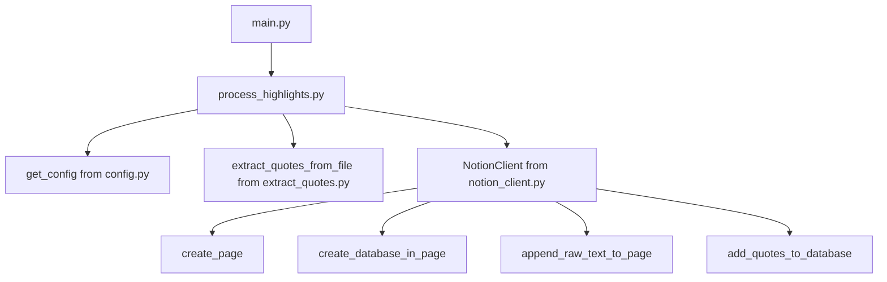

# Kindle Highlights

## Project Description

The `kindle_highlights` project is designed to help you collect and organize your Kindle highlights into a Notion database. This project provides tools to extract highlights and upload them to Notion for easy access and organization.

## Installation Instructions

To install the `kindle_highlights` project, follow these steps:

1. Clone the repository:
   ```bash
   git clone https://github.com/fabwerk90/second_brain_collector.git
   cd second_brain_collector/kindle_highlights
   ```

2. Create a virtual environment and activate it:
   ```bash
   python3 -m venv venv
   source venv/bin/activate
   ```

3. Install the required dependencies:
   ```bash
   pip install -r requirements.txt
   ```

## Usage Instructions

To process Kindle highlights and add them to Notion, use the following command:
```bash
python main.py <path_to_kindle_highlights_file> <path_to_config_file>
```

## Parameters

- `<path_to_kindle_highlights_file>`: The path to the text file containing Kindle highlights.
- `<path_to_config_file>`: The path to the YAML configuration file containing the Notion API token and database ID.

## Code Structure



## Contributing Guidelines

We welcome contributions to the `kindle_highlights` project! To contribute, please follow these steps:

1. Fork the repository.
2. Create a new branch for your feature or bugfix.
3. Make your changes and commit them with clear commit messages.
4. Push your changes to your forked repository.
5. Create a pull request to the main repository.

## License Information

This project is licensed under the Apache License 2.0. See the [LICENSE](../LICENSE) file for more information.
